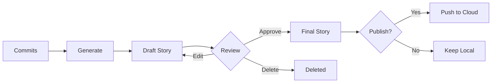

A **Story** in repr is a narrative summary of a set of code changes. It transforms raw git commits into something human-readable—professional narratives that explain what you built and why it matters.

## What's in a Story?

A story consists of:
- **Summary**: A one-line title (e.g., "Implemented OAuth2 authentication")
- **Content**: A detailed description of the work, generated by an LLM
- **Metadata**:
  - Associated repository
  - Date range (first and last commit)
  - Commit SHAs (full 40-char hashes)
  - Files changed / Lines of code
  - Technologies used
  - Generation method (local/cloud)

## Story Format Example

Here's what a generated story looks like:

### Resume Template (Default)

```markdown
## Implemented OAuth2 Authentication with SSO Support

Built a complete OAuth2 authentication system supporting Google and 
GitHub providers. Implemented PKCE flow for enhanced security in 
single-page applications. Added token refresh logic with automatic 
retry and proper error handling for expired credentials.

The system handles concurrent login requests using distributed locking 
to prevent race conditions. Integrated with existing session management 
using Redis for token storage with 30-day TTL.

**Impact:** Reduced authentication failures from 8% to <0.1%. Enabled 
SSO for enterprise customers, unblocking $2M ARR pipeline.

**Technologies:** Python, OAuth2, Redis, PKCE, FastAPI
**Commits:** 12 commits across 8 files
**Date Range:** Jan 5-12, 2026
```

### Interview Template (STAR Format)

```markdown
## Built High-Performance Authentication System

**Situation:** The existing authentication system was experiencing race 
conditions under high load, causing about 8% of login attempts to fail 
intermittently. The issue was particularly severe during peak hours 
(9am-11am EST), generating 50+ support tickets per day and frustrating 
users.

**Task:** I needed to identify the root cause of the failures, implement 
a fix without disrupting the existing session management system, and 
ensure the solution could handle 10x our current traffic to support 
anticipated growth.

**Action:** I used distributed tracing (OpenTelemetry) to identify that 
the race condition occurred during concurrent Redis operations when 
creating new sessions. I implemented distributed locking using Redis 
SETNX with proper timeout handling and exponential backoff for retries. 
I also added comprehensive monitoring and alerting so we'd catch similar 
issues faster in the future.

**Result:** Authentication failures dropped from 8% to less than 0.1%. 
Average login latency improved by 20ms. We handled Black Friday traffic 
(5x normal load) with zero auth-related incidents. The monitoring system 
I added caught two other race conditions in unrelated systems within the 
next month.

**Technologies:** Python, Redis, OpenTelemetry, Datadog, FastAPI
**Commits:** 12 commits over 8 days
```

### Changelog Template

```markdown
## Authentication System Update (v2.4.0)

### Added
- OAuth2 authentication with Google and GitHub providers
- PKCE flow implementation for enhanced security
- Automatic token refresh with retry logic
- Distributed locking for concurrent login handling
- Comprehensive monitoring and alerting

### Fixed
- Race condition in session creation (affecting 8% of users)
- Token expiration edge cases
- CORS headers for production domains

### Changed
- Migrated from stateless JWT to Redis-backed sessions
- Updated session TTL from 7 days to 30 days
- Improved error messages for authentication failures

**Commits:** 12
**Files Changed:** 8
**Lines:** +450 / -120
```

### Narrative Template (Story Format)

```markdown
## The Authentication Overhaul

We started the year knowing our auth system was fragile. About 8% of 
login attempts were failing, and we couldn't figure out why. The logs 
showed successful authentication, but users were seeing "please try 
again" errors.

After instrumenting the system with distributed tracing, the problem 
became clear: race conditions during session creation. Multiple 
concurrent requests for the same user would try to create Redis keys 
simultaneously, and sometimes all of them would fail.

The fix required careful thought. We couldn't just throw a mutex at 
it—that would create a single point of failure. Instead, we implemented 
distributed locking using Redis SETNX with proper timeout handling. If 
a lock couldn't be acquired, requests would back off exponentially and 
retry.

The results were immediate. Authentication failures dropped to nearly 
zero. But more importantly, we learned the value of observability. The 
tracing we added caught two other race conditions in the following 
weeks, preventing future outages before they happened.

**Technologies:** Python, Redis, OpenTelemetry, Datadog
**Timeline:** 8 days (Jan 5-12, 2026)
**Impact:** 8% → 0.1% failure rate, 20ms latency improvement
```

## How Stories are Created

Stories are generated via the `repr generate` command:

1. **Selection**: Repr selects a batch of commits (from the queue, specific SHAs, or date range)
2. **Analysis**: The diffs are analyzed to understand *what* changed and *why*
3. **Generation**: An LLM (Local or Cloud) writes the narrative based on a [Template](/concepts/templates)
4. **Storage**: The story is saved as a Markdown file in `~/.repr/stories/<id>.md`

```bash
# Generate stories from recent work
repr generate --local

# Use specific template
repr generate --template interview --local

# Generate from specific commits
repr generate --commits abc1234,def5678 --template changelog
```

## Story Metadata

Each story includes rich metadata stored in frontmatter:

```yaml
---
id: 01ARYZ6S41TSV4RRFFQ69G5FAV
summary: "Implemented OAuth2 authentication with SSO support"
repo_name: "backend-api"
repo_path: "/Users/me/code/backend-api"
commit_shas:
  - abc123def456...
  - def456ghi789...
first_commit_at: "2026-01-05T09:30:00Z"
last_commit_at: "2026-01-12T16:45:00Z"
files_changed: 8
lines_added: 450
lines_removed: 120
technologies:
  - Python
  - OAuth2
  - Redis
  - FastAPI
generated_locally: true
template: "resume"
needs_review: false
is_featured: false
is_hidden: false
created_at: "2026-01-12T17:00:00Z"
---
```

## Story Lifecycle



### States

- **Draft** (`needs_review: true`) - Newly generated, not yet approved
- **Approved** (`needs_review: false`) - Reviewed and ready
- **Featured** (`is_featured: true`) - Pinned to top of your profile
- **Hidden** (`is_hidden: true`) - Excluded from public profile
- **Pushed** (`pushed_at: <timestamp>`) - Published to repr.dev

### Commands

```bash
# View stories
repr stories

# Review drafts
repr review

# Edit a story
repr story edit 01ARYZ6S41TSV4RRFFQ69G5FAV

# Feature a story (pin to profile)
repr story feature 01ARYZ6S41TSV4RRFFQ69G5FAV

# Hide from public profile
repr story hide 01ARYZ6S41TSV4RRFFQ69G5FAV

# Delete
repr story delete 01ARYZ6S41TSV4RRFFQ69G5FAV
```

## Privacy & Storage

Stories are stored locally by default in `~/.repr/stories/` as Markdown files:

```
~/.repr/
├── stories/
│   ├── 01ARYZ6S41TSV4RRFFQ69G5FAV.md
│   ├── 01BSTZ7T52UTV5SSGGR70H6GBW.md
│   └── 01CTUA8U63VUW6TTHHS81I7HCX.md
├── config.json
└── queue
```

**Privacy guarantee:** Stories are only uploaded to the cloud if you explicitly run:
- `repr push` - Publish specific stories
- `repr push --all` - Publish all unpushed stories
- `repr sync` - Bidirectional sync

**Backup:** Stories are human-readable Markdown files. You can:
- Read them in any text editor
- Version control them (`git init ~/.repr/stories`)
- Backup with `repr data backup`
- Export with `repr profile export`

## Use Cases

Different templates serve different purposes:

| Use Case | Template | Why |
|----------|----------|-----|
| **Performance Review** | `resume` | Quantified impact, action verbs |
| **Job Interview Prep** | `interview` | STAR format, behavioral questions |
| **Sprint Demo** | `changelog` | What shipped, categorized |
| **Blog Post** | `narrative` | Storytelling, technical journey |
| **Weekly Update** | `resume` | Professional, stakeholder-friendly |
| **Portfolio** | `resume` | Highlight best work, impact-focused |

## Related Concepts

- [Templates](/concepts/templates) - Control story voice and format
- [Privacy Model](/concepts/privacy-model) - How data is protected
- [Repos and Hooks](/concepts/repos-and-hooks) - Automatic capture

